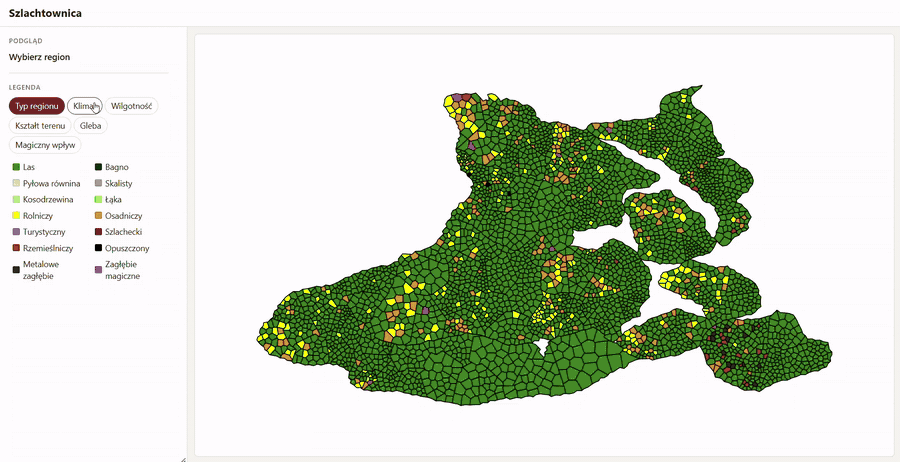

# Szlachtownica – frontend

Frontend w Angularze 17 do projektu [Szlachtownica](https://github.com/mfurmane/szlachtownica2). Projekt jest w trakcie rozwoju.

## Co robi

- Pobiera z backendu geometrie prowincji i regionów (GeoJSON) i rysuje je jako interaktywną mapę SVG, w której kolor regionu oznacza jego typ.
- Mapę można przybliżać kółkiem myszy i przesuwać przeciąganiem.
- Po kliknięciu regionu panel boczny pokazuje jego szczegóły: typ, ukształtowanie terenu, klimat, wilgotność, glebę i wpływ magii.



Stan między mapą a panelem jest współdzielony przez serwis oparty na `BehaviorSubject`.

## Uruchomienie

Wymagany jest działający [backend](https://github.com/mfurmane/szlachtownica2) (Spring Boot, PostgreSQL + Hibernate Spatial) pod adresem `http://localhost:8080`.

```bash
npm install
npm start
```

Aplikacja będzie dostępna pod `http://localhost:4200/`.
